# Portfolio Documentation

---

## [T1A2 Site](https://dynamic-malasada-7a2b5e.netlify.app/index.html)

---

## [GitHub Repo](https://github.com/rulerrobin/PortfolioSite)

---

## Purpose
---

The purpose of the website made for T1A2 was as an assignment to creata a basic portfolio website using the knowledge that we have accumulated in the past few weeks of this first term. 
* Present who I am and what my perspective is to development for future employers in the software engineering industry
* Provide information about my skills and experiences at a glance
* Make a good first impression
* Showcase the skills I have accumulated so far

## Target audience
---
Employers, hiring managers and clients alike. At the moment this would be more targeted towards those looking for junior developers because of this they would likely have some knowledge towards software and tech stacks.

## Functionality / features
---
The website is designed and coded in such a way that it is responsive and intuitive across different devices. There are 4 main pages that all have a theme to them with a header and footer located on each page. I have used a minimal approach using few colors only being blue for the main color, red for the secondary color and white/grey for the text.

Overall themes of the pages are the headings are either in white or red depending on where it is used. The main text is also in white and secondary text that is used to point to main text is in grey.

If there is a link the cursor will change into a pointer to show it is interactable and links will also transform to be a little bigger as well as change color over a short amount of time.

1. Home: The landing page has a description of of myself and call to action to go to about page as well as the tech stack familiar with with a link to the portfolio page. The page also links to socials right above the call to action.
2. About: Information on previous work history or skills as well as a quick summary of what experience I have in those roles or experiences through a hover on desktop. It also houses a call to action to open a CV at the top of the page.
3. Portfolio: This page is where a summary of a project is written with an image of the project as well. This page also has a call to action for reading more about the project under the excerpt text.
4. Contact: A simple page that has links to socials again if needed with a form that assists with contacting myself through opening the email app and placing text in the form in an email to myself.

## Sitemap
---
Basic sitemap used to understand how user would interact with the site.

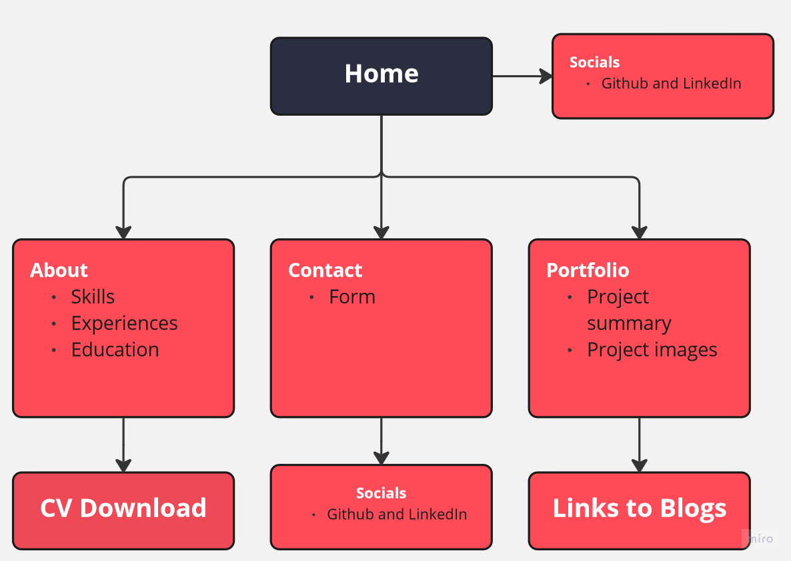

## Screenshots
---

Some screenshots were taken zoomed out so that it fit the screenshot size so it could fit more of the page. For the portfolio screenshot it was only the top screenshotted because it essentially repeats itself if I was to zoom it out as the content is the same.

### Wireframes 
---
**Home Page**

Mobile

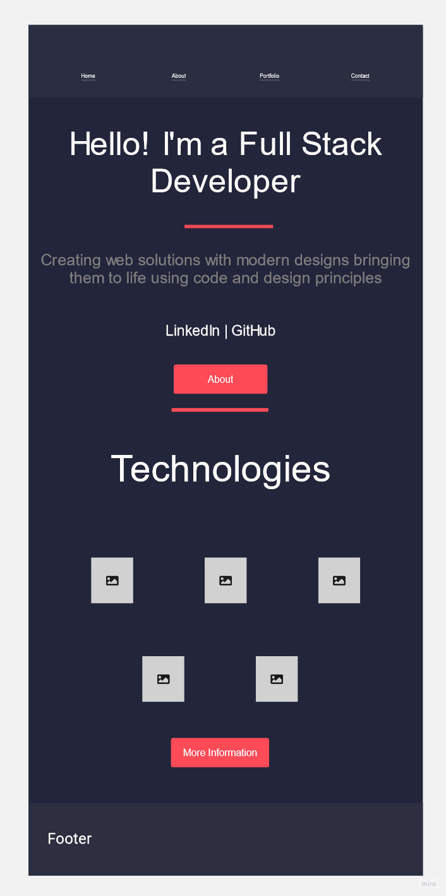

Desktop

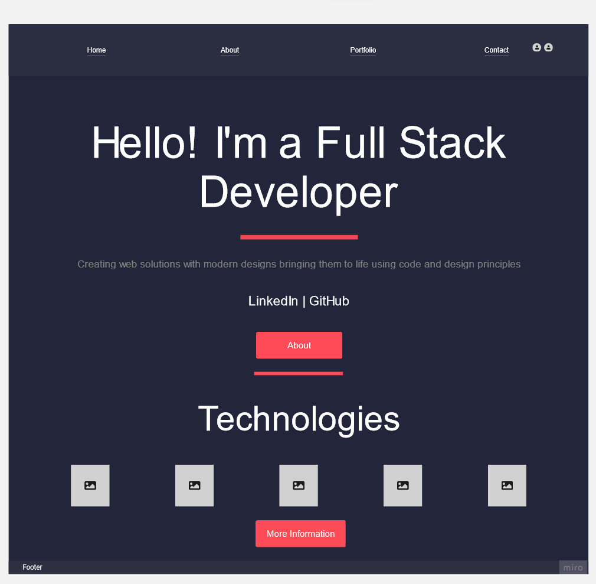

**About Page**

Mobile

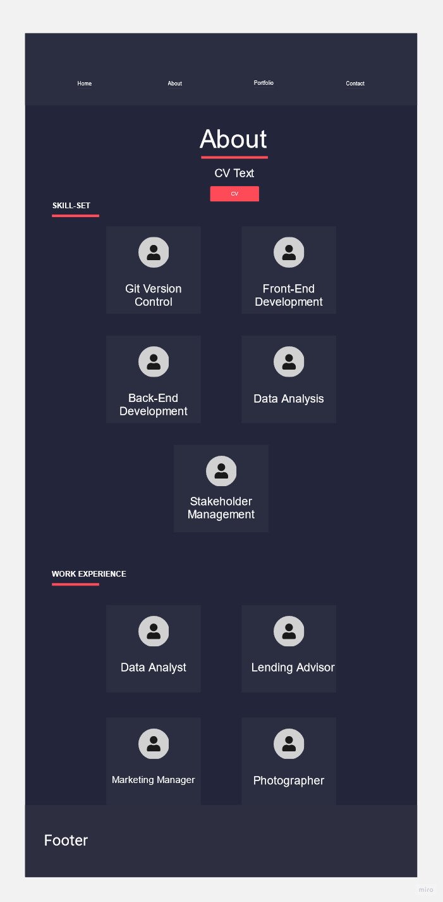

Desktop

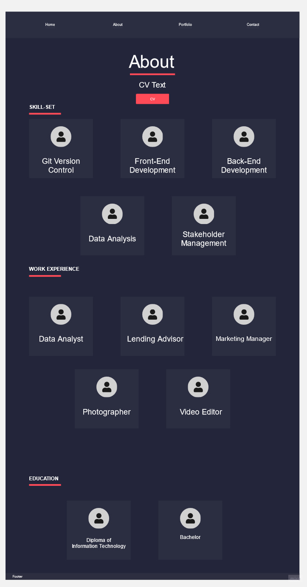

**Portfolio Page**

Mobile

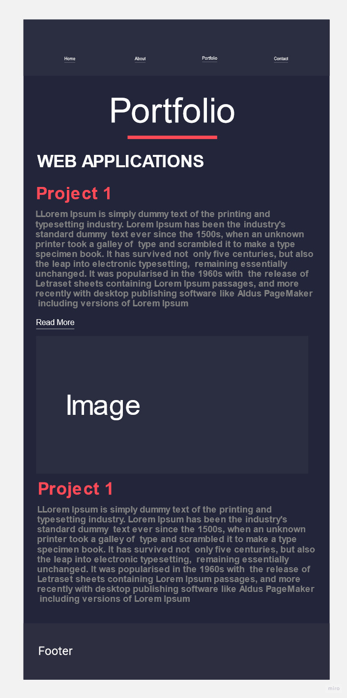

Desktop

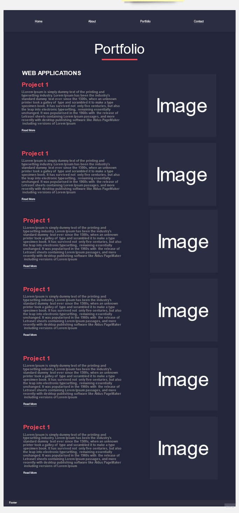

**Contact Page**

Mobile

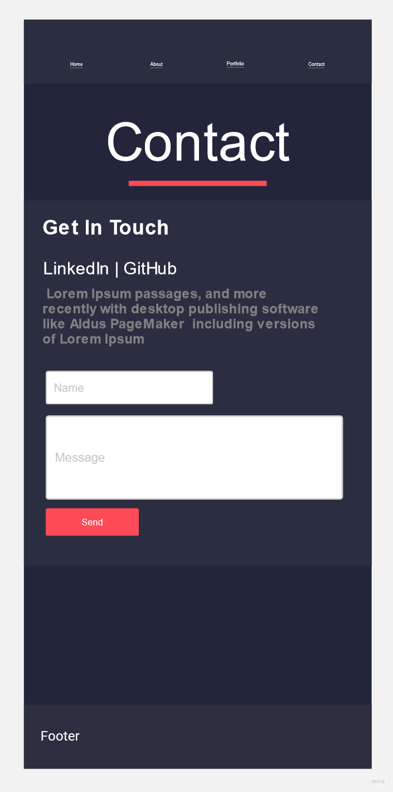

Desktop

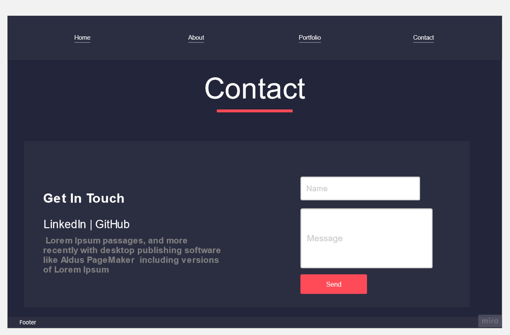

### Deployed Site Screenshots

**Home Page**

Mobile

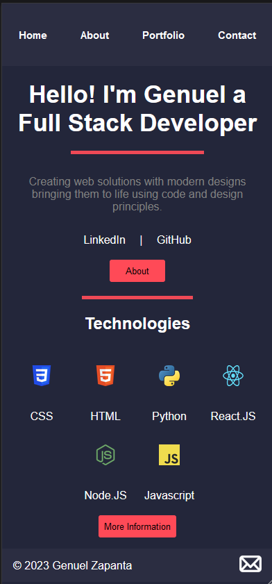

Desktop

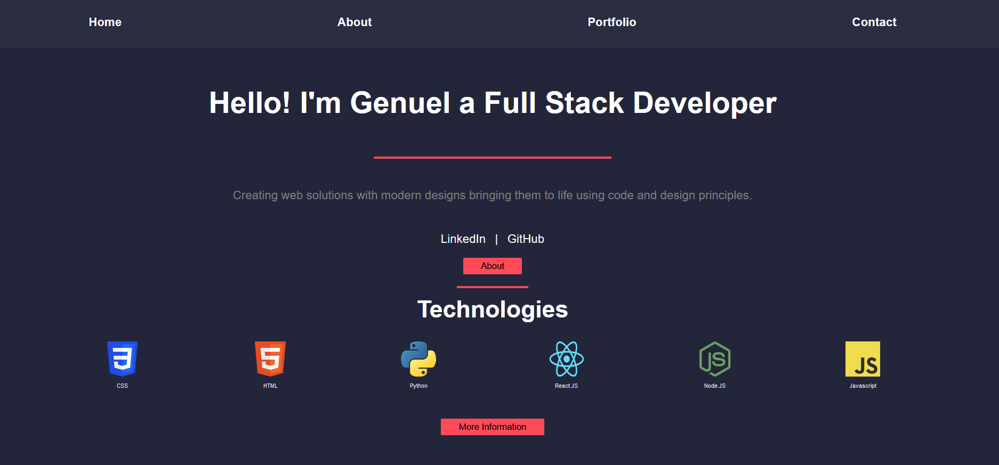

**About Page**

Mobile

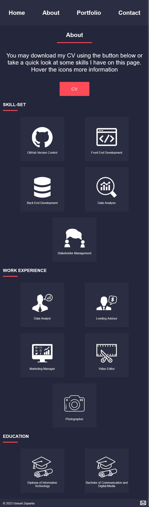

Desktop

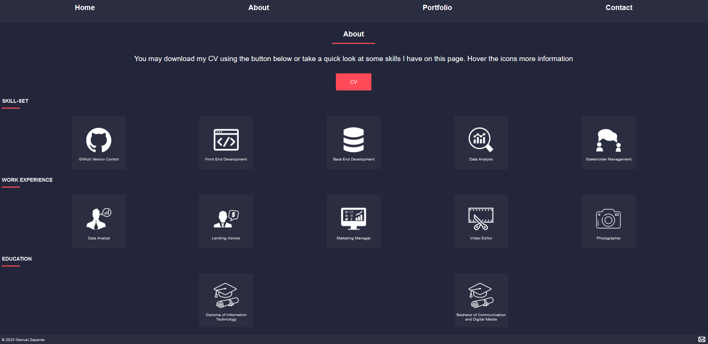

Hovers

When hovered it will reveal the text underneath.

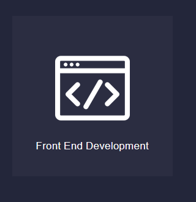 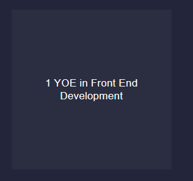

**Portfolio Page**

Mobile

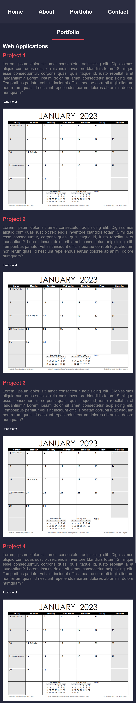

Desktop

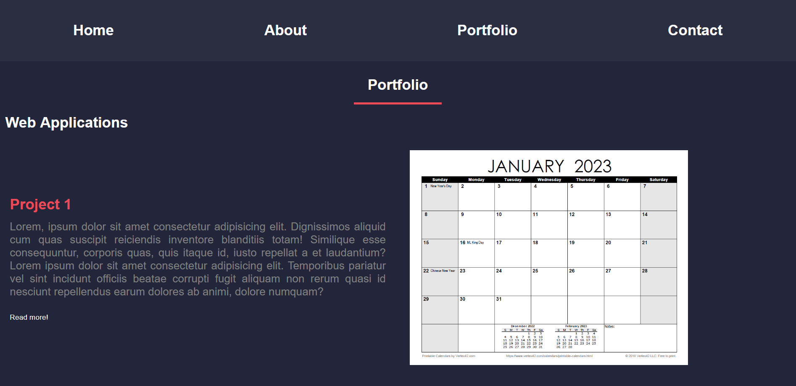

**Contact Page**

Mobile

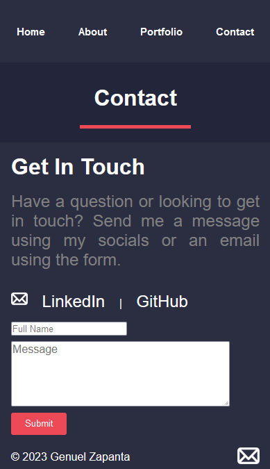

Desktop

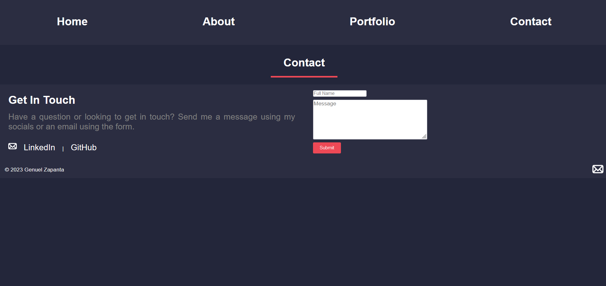

**Extra**

When hovered links will transform to become bigger and change color as well as cursor will change to pointer, except for buttons and the mail icon in the footer. The mail icons will only enlarge themselves.

## Tech stack (e.g. html, css, deployment platform, etc)
---
* Website: HTML5 and CSS
* Deployment: Netlify
* Workflow: Mobile first workflow 
* Methodology: Kanban
* Sitemap and Wireframes: Miro
* Slide Deck: Powerpoint/Canva
